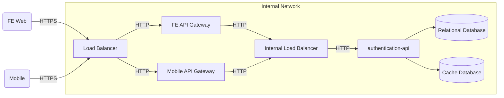

## Getting Started

The Authentication API is an application that provides a **central platform for authentication, authorization, client, and session management.** It is used by different applications (e.g., mobile and web front-ends) to integrate securely into our ecosystem.

## Design

## Principal integration points

1. **LB (Load Balancer)**
   - Built with Nginx
   - Handle rate limit, edge routings to the gateways and backend applications
2. **API Gateway**
   - Built with Spring Cloud Gateway
   - Handle front end request and apply the necessary policies depending on the api gateway and forward the correct data to the backend
3. **Authentication-api**
   - Built with Spring + Kotlin
   - Backend application
4. **Relation Database**
   - PostgreSQL
5. **Cache**
   - Redis

## Functionalities

1. **[Users](/authentication-api/domains?id=users)**
   - Manages users of the system, allowing them to request access to authorized resources through various clients.
2. **[Authorization code with PKCE](/authentication-api/domains?id=authorization-code-with-pkce)**
   - Implements the OAuth 2.0 authorization code flow with PKCE for secure authorization of public clients.
3. **[Session management](/authentication-api/domains?id=introspection)**
   - Provides a secure mechanism to track and manage user sessions after authentication. It ensures that once a user has been authenticated, they can access the application's resources without needing to re-enter their credentials for every request.

## Support material

- [The OAuth 2.0 Authorization Framework](https://www.rfc-editor.org/rfc/rfc6749)
- [Proof Key for Code Exchange by OAuth Public Clients](https://www.rfc-editor.org/rfc/rfc7636)
