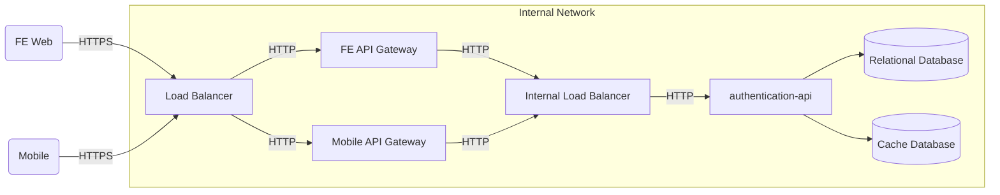

## Getting Started

The Authentication API is an application that provides a **central platform for authentication, authorization, client, and session management.** It is used by different applications (e.g., mobile and web front-ends) to integrate securely into our ecosystem.

## Design

## Main integration points

1. **LB (Load Balancer)**
   - Built with Nginx
   - Handles rate limiting, edge routing to the gateways, and backend applications.
2. **API Gateway**
   - Built with Spring Cloud Gateway
   - Handles front-end requests, applies the necessary policies depending on the API gateway, and forwards the correct data to the backend.
3. **Authentication-api**
   - Built with Spring + Kotlin
   - Backend application.
4. **Relational Database**
   - PostgreSQL
5. **Cache**
   - Redis

## Functionalities

1. **Users**
   - Manages users of the system, allowing them to request access to authorized resources through various clients.
2. **Session management**
   - Provides a secure mechanism to track and manage user sessions after authentication. It ensures that once a user has been authenticated, they can access the application's resources without needing to re-enter their credentials for every request.
3. **Login**
   - Basic and secure authentication using email and password to identify and authenticate users in our ecosystem.

## Supporting material

- [The OAuth 2.0 Authorization Framework](https://www.rfc-editor.org/rfc/rfc6749)
