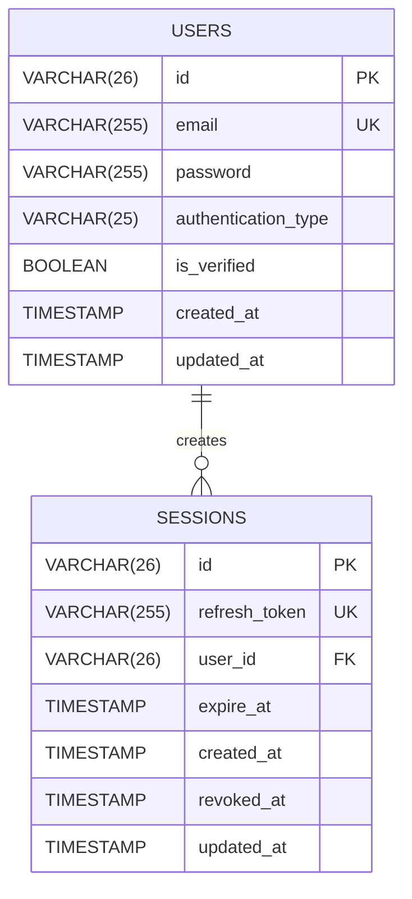

## Data Model

1. **Users**

   - This table stores user accounts, including credentials and verification status.
   - `id` is a unique identifier for each user.
   - `email` must be unique.
   - `password` must be in hash format.
   - `authentication_type` defines the login method (e.g., `PASSWORD`, `GOOGLE`).

2. **Sessions**
   - Manages authenticated user sessions.
   - `id` is the unique session identifier.
   - `refresh_token` is used to obtain new access tokens.
   - `user_id` links the session to a user.
   - `revoked_at` indicates if the session has been revoked.

---
